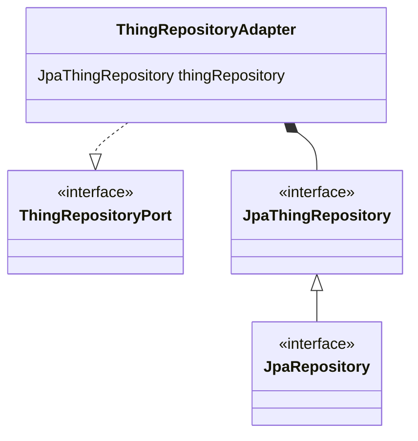

# Estrutura de um Repository

<!-- https://github.com/joelparkerhenderson/architecture-decision-record/tree/main/locales/en/templates/decision-record-template-by-michael-nygard -->

## Status

Aceito

## Contexto

O JPA funciona utilizando de uma interface que herda de JpaRepository (ou outros). Precisamos de uma forma de
conectar o JPA à *port* do *repository* através do *adapter*.

## Decisão

Utilizando a estrutura descrita no diagrama abaixo, podemos criar *adapters* que implementam as *ports* e acessam as
funcionalidades do JPA utilizando de composição. Assim, os métodos dos *adapters* serão basicamente wrappers que
implementam a *port* com os métodos da interface do JPA. Por fim, os *repositories* também serão responsáveis por
mapear os DTOs do banco para objetos do modelo do domínio.

## Consequências

Teremos uma classe *wrapper* que não tem um uso prático, fora fazer o mapeamento, e será necessário copiar os métodos
desejados para a *port* na interface do JPA aumentando a duplicação de código e consequentemente o custo de manutenção.