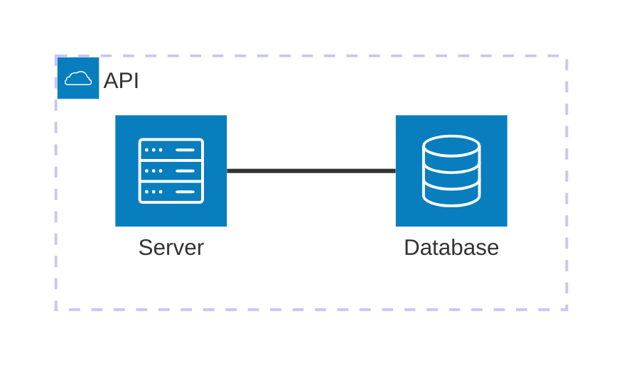

# Software Design Description (SDD)

<!-- https://www.atlassian.com/work-management/knowledge-sharing/documentation/software-design-document -->

## Introdução

Este projeto busca desenvolver e projetar uma aplicação de gestão de tarefas colaborativas conforme
a [definição do trabalho](../definicao.md) seguindo uma arquitetura hexagonal. Para a autenticação e autorização dos
usuários, será implementado um sistema próprio com o auxílio da biblioteca Spring Security.

## System architecture

Em um alto nível, teremos um servidor que expõe sua API para o mundo e utiliza um banco de dados para persistência das
tarefas. Por enquanto, o servidor será responsável pela autenticação e autorização dos usuários e também o gerenciamento
das tarefas.

